# Active Directory Home Lab

## What’s This About?  
This project is my first attempt at setting up a **simulated corporate environment** using VirtualBox, Windows Server, and Windows 10. I wanted to learn how to configure **Active Directory**, **DHCP**, and **DNS**, and automate tasks using **PowerShell**. It’s been a fun way to get hands-on experience with enterprise IT tools and understand how everything works together.

---

### 0. Diagram  
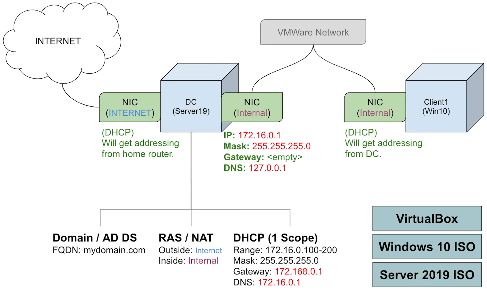  
*This is the diagram I followed for the project. Big thanks to [@joshmadakor](https://github.com/joshmadakor) for the inspiration!*  

---

### What I Learned  
- **Active Directory Basics**: Setting up a domain controller, creating users, and organizing them into groups.  
- **DHCP and DNS**: How to automatically assign IP addresses and make sure devices can find each other on the network.  
- **PowerShell Scripting**: Writing a script to create users automatically instead of doing it one by one.  
- **Troubleshooting**: Figuring out why things weren’t working (like why a client couldn’t get an IP address).  
- **Multilingual Setup**: Configuring a client in Russian to show I can work in different languages.  

---

### Tools I Used  
- **VirtualBox**: To create and manage virtual machines.  
- **Windows Server 2019**: For the domain controller, DHCP, and DNS.  
- **Windows 10**: For the client machines that joined the domain.  
- **PowerShell**: To automate boring tasks like creating users.  
- **Active Directory Users and Computers (ADUC)**: For managing users and groups.  

---

## How I Did It  

### 1. Creating the Domain Controller VM  
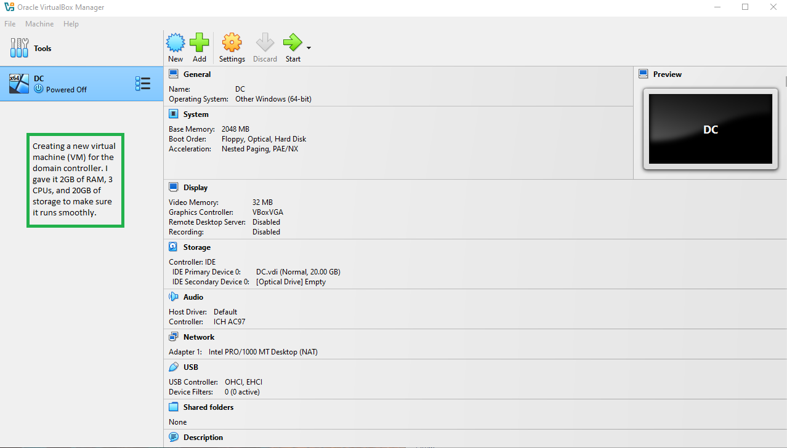  
*I created a virtual machine for the domain controller using Windows Server 2019. I gave it 2GB of RAM, 3 CPUs, and 20GB of storage to make sure it runs smoothly.*  

---

### 2. Setting Up the Second Network Adapter  
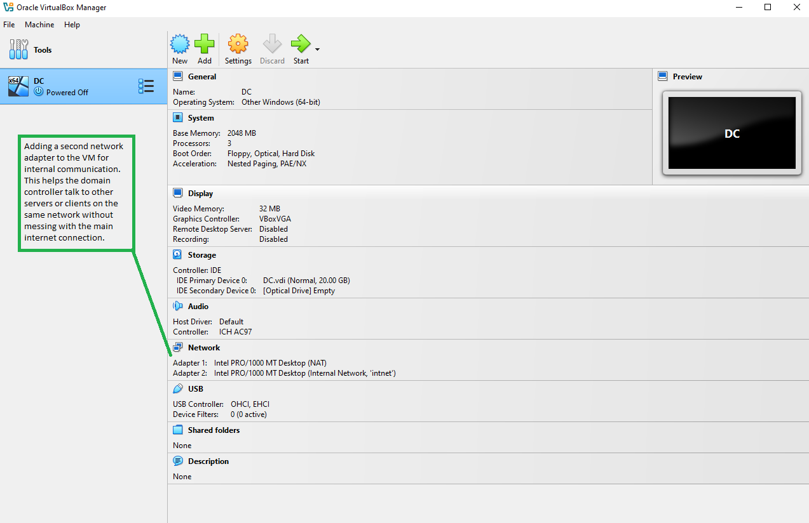  
*I added a second network adapter to the VM and set it to **Internal Network** so the domain controller and clients can communicate.*  

---

### 3. Installing Windows Server 2019  
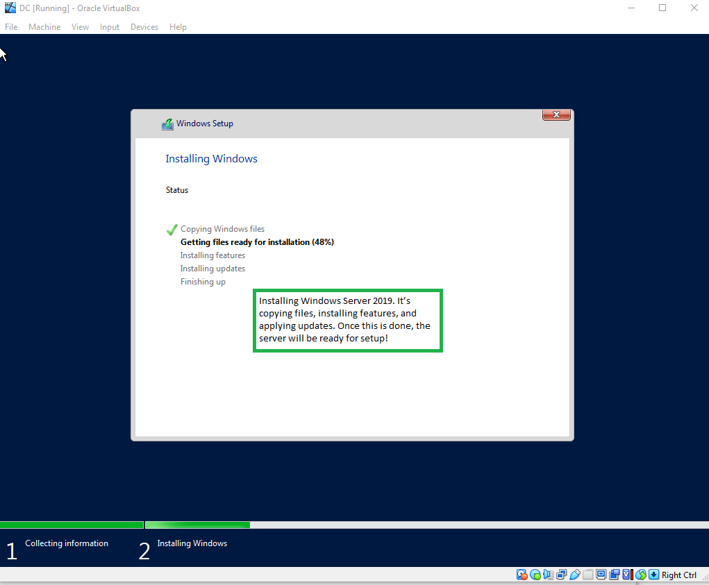  
*I installed Windows Server 2019 on the VM. The setup process included copying files, installing features, and applying updates.*  

---

### 4. Windows Server Ready  
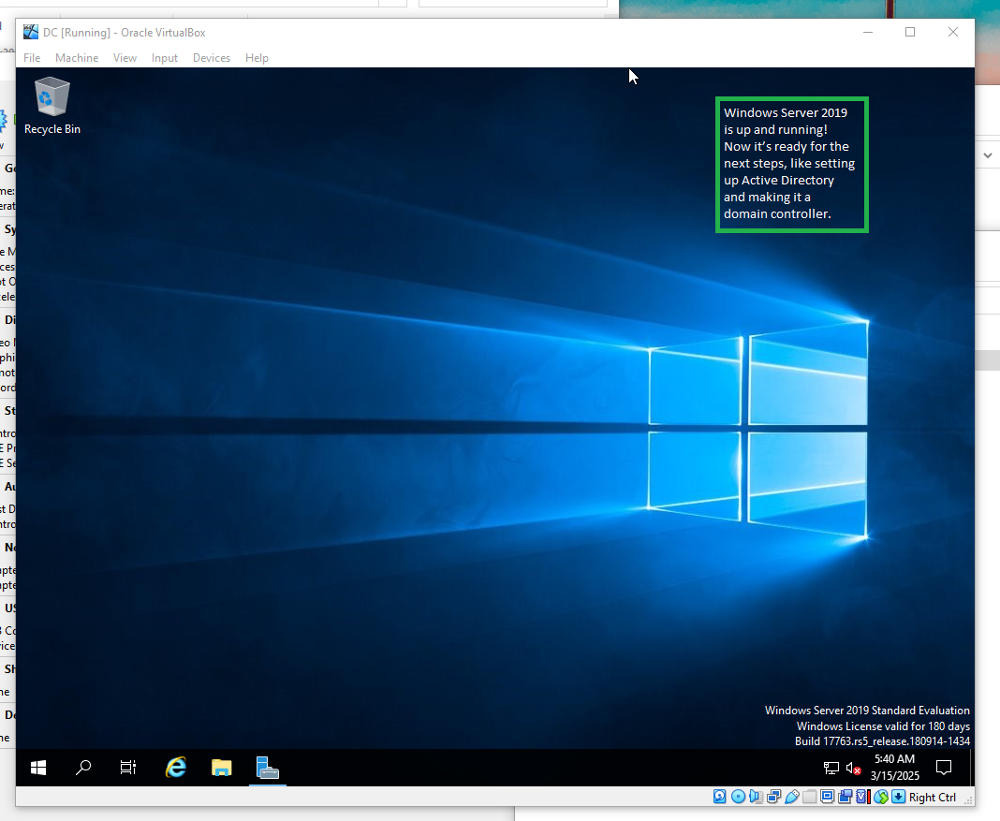  
*Windows Server 2019 was successfully installed and ready for configuration.*  

---

### 5. Configuring the NIC and IP Address  
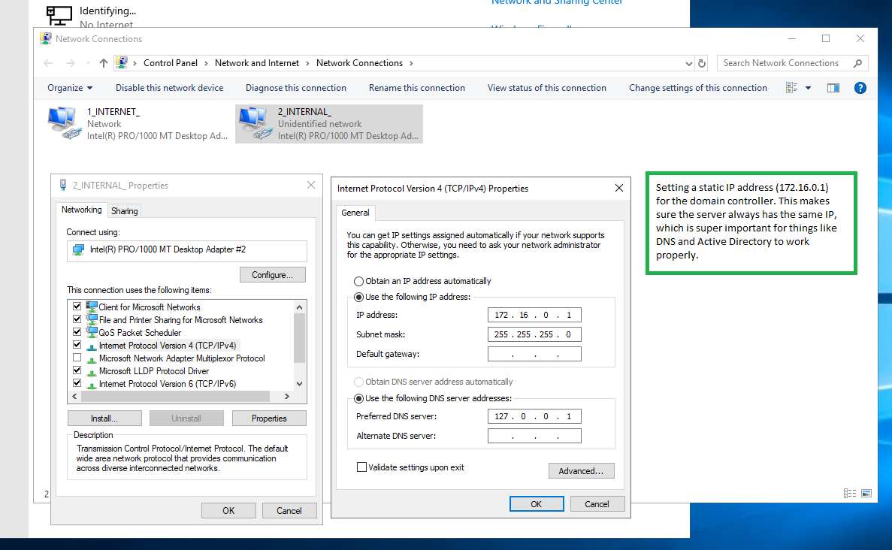  
*I set a static IP address (`172.16.0.1`) for the domain controller. This ensures the server always has the same IP, which is important for DNS and Active Directory.*  

---

### 6. Setting Up Active Directory  
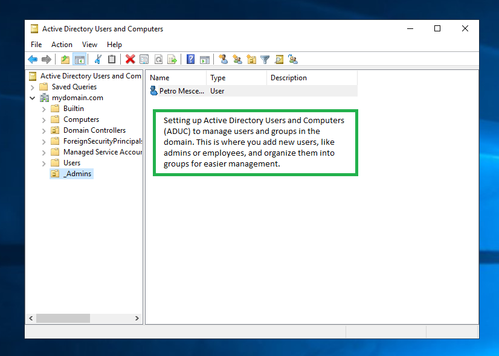  
*I installed Active Directory and set up the domain `mydomain.com`. Then, I created some organizational units (OUs) to organize users and computers.*  

---

### 7. Configuring Routing and Remote Access  
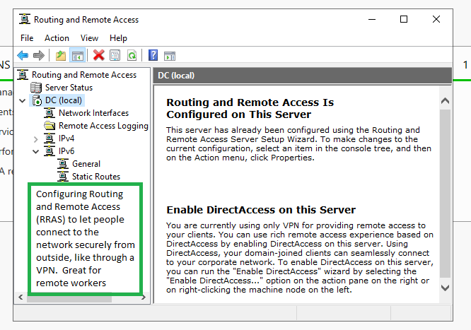  
*I set up Routing and Remote Access (RRAS) to allow secure remote connections, like VPNs, to the network.*  

---

### 8. Setting Up DHCP Lease Duration  
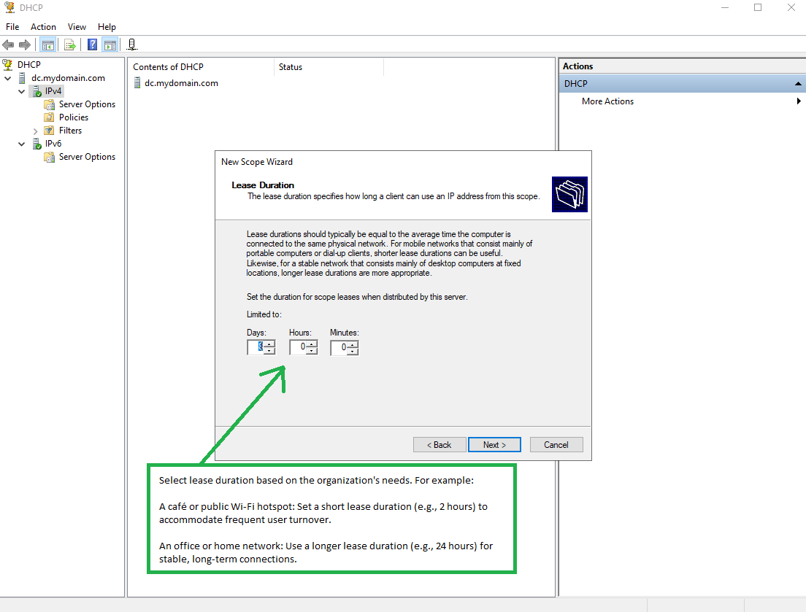  
*I configured the DHCP lease duration based on the organization’s needs. For example, a café might use a short lease (e.g., 2 hours), while an office might use a longer lease (e.g., 24 hours).*  

---

### 9. Setting Up DHCP  
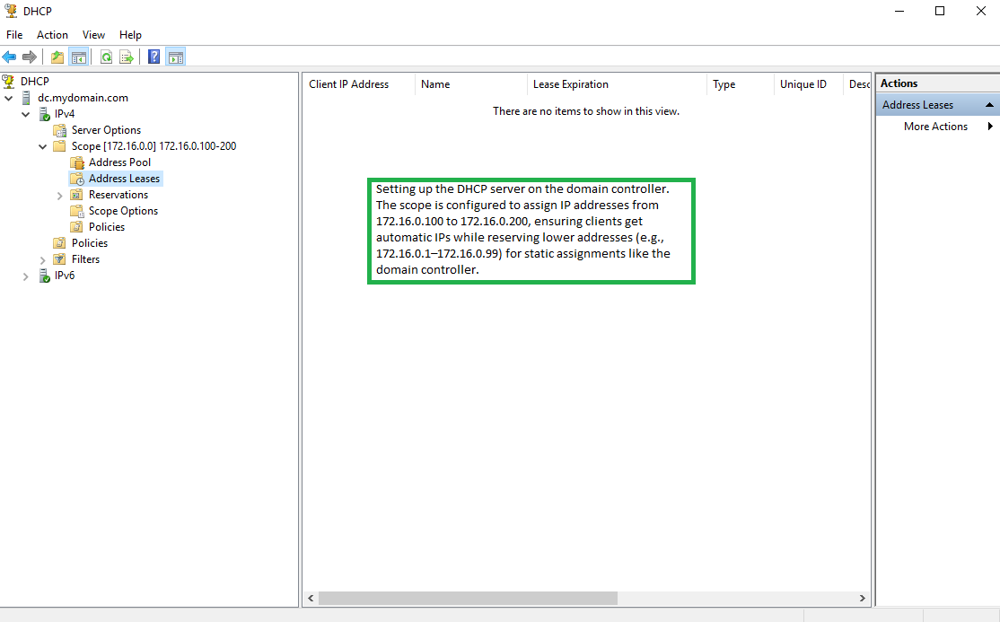  
*I configured the DHCP server to automatically assign IP addresses in the range `172.16.0.100–172.16.0.200`. I left the lower IPs (like `172.16.0.1`) for the domain controller and other important devices.*  

---

### 10. Automating User Creation with PowerShell  
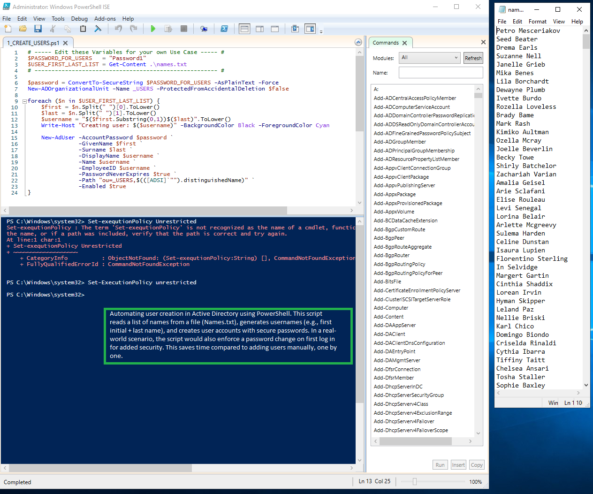  
*I wrote a PowerShell script to create users automatically. It reads names from a file (`Names.txt`), generates usernames (like first initial + last name), and sets up accounts with secure passwords.*  

---

### 11. Users Created Successfully  
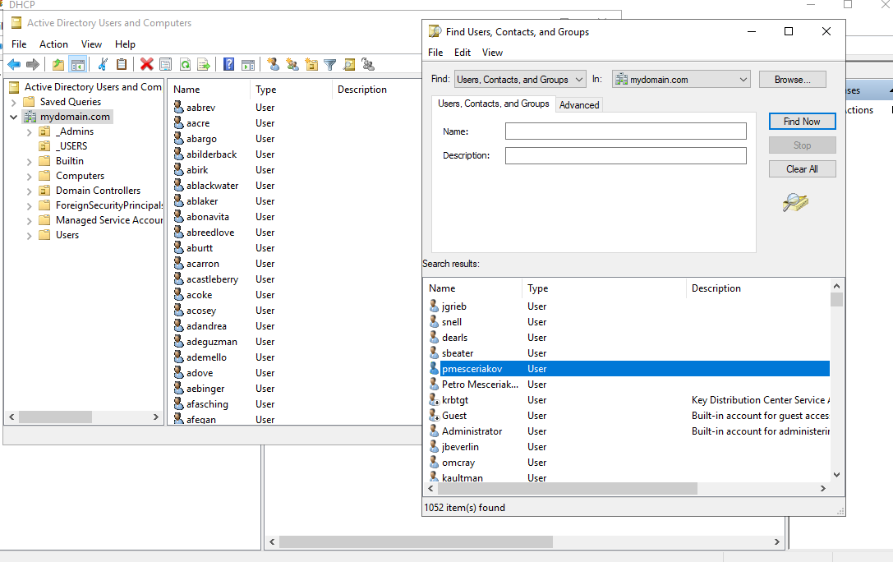  
*The PowerShell script successfully created user accounts in Active Directory. This saved me a lot of time compared to adding users manually!*  

---

### 12. Joining Clients to the Domain  
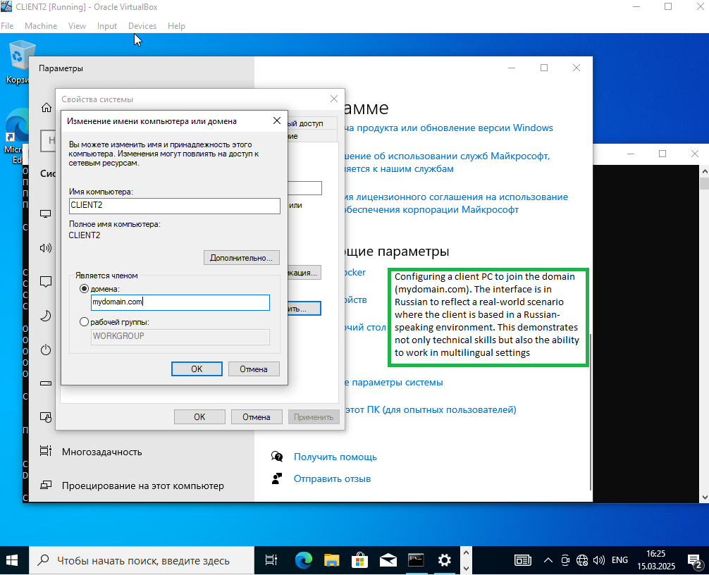  
*I joined a Windows 10 client (`CLIENT2`) to the domain `mydomain.com`. I set the interface to Russian to make it feel more realistic and show off my language skills!*  

---

### 13. Verifying DHCP Functionality  
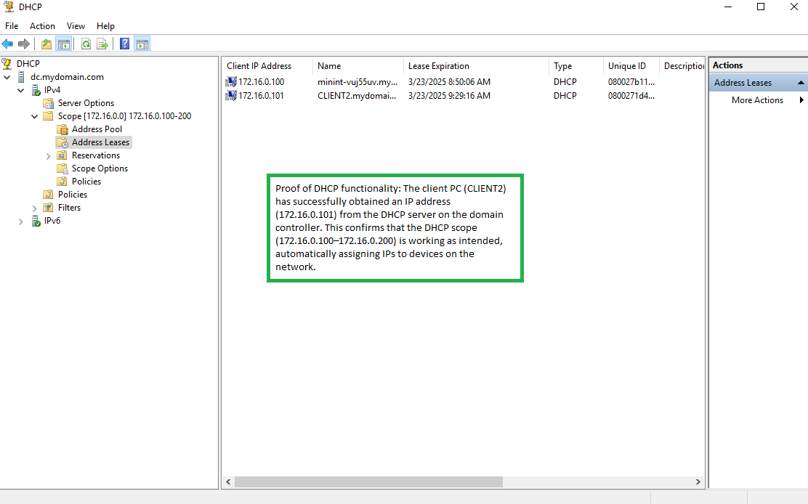  
*I checked the DHCP server to make sure it was working. The client (`CLIENT2`) got an IP address (`172.16.0.101`), and I saw a temporary name (`minint-vuj5bw`) that Windows uses during setup.*  

---

### 14. Testing User Login  
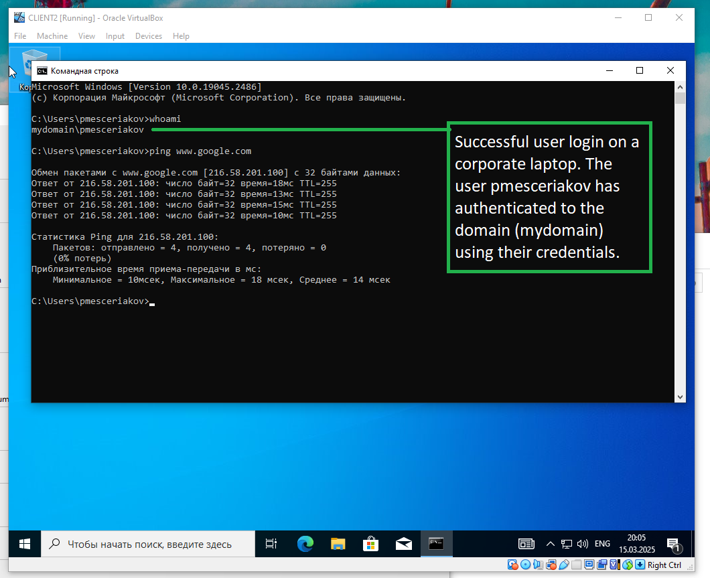  
*I logged in as `pmesceriakov` on a domain-joined client to make sure everything worked. It felt like a real corporate environment!*  

---

## What I Got Out of This  
This project was a great way to learn the basics of Active Directory, DHCP, and PowerShell. I made mistakes along the way (like forgetting to enable the right network adapter), but I figured them out and learned a lot. It’s cool to see how all these pieces fit together in a real-world IT setup.  

---

## License  
This project is licensed under the [MIT License](LICENSE).  
